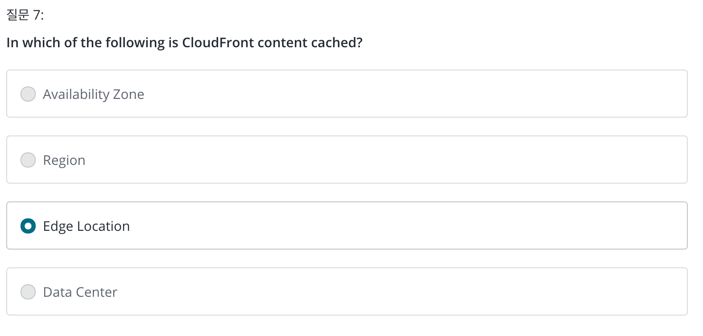

# Section 1 - 2

> 2019.11.27. Wed.

# 3. The exam blueprint

* 130분
* 60문항
* Multiple choice
* 720 점 이상 PASS : 100 ~ 1000
* 유효기간 2년

# 4. The history of AWS

* **2003** :  Chris Pinkham & Benjamin Black present a paper on what Amazon's own internal infrastructure should look like. They suggested selling it as a service and prepared a business case.
* **2004** : SQS officially launched. (queue service or message service and allows you to decouple your infrastructure)

* **2006** : AWS Offically launched.
* **2007** : over 180,000 developers on the platform.
* **2010** : all of amazon.com moved over aws.
* **2012** : First re:Invent Conference.
* **2013** : Certifications Launched.
* **2014** : Committed to achieve 100% renewable energy usage for its global footprint.
* **2015** : AWS breaks out its revenue : $6 B per annum and growing close to 90% on year
* **2017** : Run rate of $13B.
* **2017** : AWS re:invent releases a host of AI services. Run rate hits $27 B.
* **2018** : AWS launch ML Specialty Certs. Heavy focus on automating AI & ML.
* **2019** : Alexa Specialty Beta Cert. launched. 10 Certs!

# 5. AWS - 10,000 Foot Overview

> 모든 서비스를 일일히 말하는건 SAA 준비에 도움이 되지 않는다. (ex Amazon Connect, Pinpoint , Deeplens, ...)

&rarr; High level services : Compute, storage, databases, migration and transfer etc..

### What do I need to know to pass my SAA exam?

## Region, availability zone and edge location

> edge location is not a region. It's actually just a sort of a smaller location that aws has, and it is used for caching content.

### abstract.

* Region : physical location in the wrold whic consists of two or more AZ.
* AZ : one or more discrete data centers, each with redundant power, networking and connectivity, housed in separate facilities.
* Edge Locations : endpoints for AWS which are used for caching content. Typically this consists of CloudFront, Amazon's Content Delivery Network (CDN).

## Section 2 QUIZ

> Amazon VPC는 Amazon EC2의 네트워킹 계층입니다.

