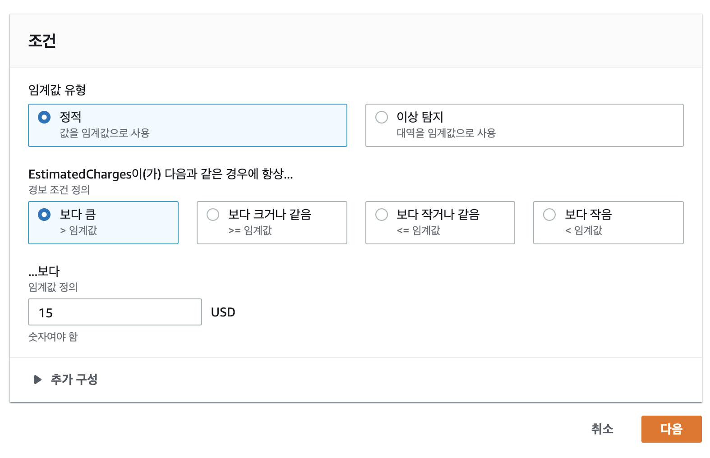
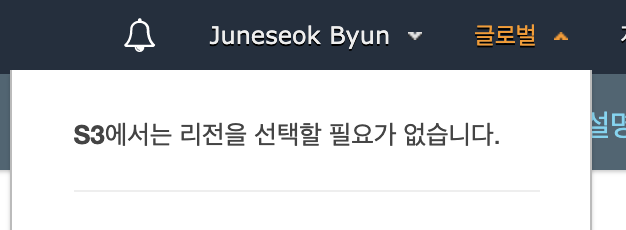

# Section 3 : Identity Access Management & S3

## 7. IAM 101

* IAM : allows you to manage users and their level of access to the AWS Console. It's important to understand IAM and how it works, both for the exam and for administrating company's AWS account in real life.


### Key features of IAM

* Centralised control of your AWS account.

* Shared access to your AWS account.

* Granular Permissions 

  > Granular : "세분화"

* Identity Federation (including active directory, Facebook, Linked etc)

  > federation : "연합"

* Multifactor Authentication

* Provide temporary access for users/devices and services where neessary.

* Allows you to setup your own password rotation policy.

* Integrates with many different AWS services.

* Supports PCI DSS Compliance


### Key Terminology for IAM

#### 1. Users

End users such as people, employees of an organization etc.

#### 2. Groups

A collection of users. Each user in the group will inherit the permissions of the group.

#### 3. Polices

Polices are made up of documents, called `policy document`. These documents are in a format called JSON and they give permissions as to what a User/Group/Role is able to do.

#### 4. Roles

You create roles and then assign them to AWS Resources.


## 8. IAM Lab


&rarr; Universal namespace 


* **Activate MFA (Multi Factor authentication) on your root account.**

  * root account = god mode.

  * 

    > 이 메뉴에서는 "글로벌" 이다. 


* **Create individual IAM users.**

  * Programmatic access (프로그래밍 방식 액세스) : AWS API, CLI, SDK 및 기타 개발 도구에 대해 **액세스 키 ID** 및 **비밀 액세스 키** 을(를) 활성화합니다.
  * AWS Management console access : 사용자가 AWS Management Console에 로그인할 수 있도록 허용하는 **비밀번호** 을(를) 활성화합니다.

  

  ```json
  {
      "Version": "2012-10-17",
      "Statement": [
          {
              "Effect": "Allow",
              "Action": "*",
              "Resource": "*"
          }
      ]
  }
  ```

  > It's god mode.

  * Username

  * Password
  * Access key ID &rarr; Username for programmatic access
  * Secret access key &rarr; Password for programmatic access

  

* **Apply an IAM password policy**


### Role


### ✅ Abstract

* **IAM is universal.** It does not apply to regions at this time
* The **root account** is simply the account created when first setup your AWS account. It has complete Admin
* New users have **No permissions** when first created
* new User are assigned **Access Key ID & Secret Access Keys** when first created.
* **These are not the same as a password.** You can't use the access key ID & Secret access key to login into the console. You can use this to access AWS via the APIs and CLI, however.
* **You only get to view these once.** If you lose them, you have to regenerate them. So, save them in a secure location.
* Always setup **MFA** on your root account.
* You can create and customise your own password rotation policies.


## 9. Create a billing alarm.




&rarr;  SNS (simple notification service)


## 10. S3 101

### What is S3?

S3 provides developers and IT teams with secure, durable, highly-scalable object storage. S3 is easy to use, with a simple web services interface to store and retrieve any amount of data from anywhere on the web.

* S3 is a safe place to store your files.
* It's Object-based storage
* The data is spread across multiple devices and facilities.

* S3 is **object-based**

* Files can be from 0 Bytes to 5TB

* There is unlimited storage.

* Files are stored in Buckets.

  > It's just a folder.

* S3 is a **universal namespace**. That is, names must be unique globally.

  ```
  https://s3-eu-west-1.amazonaws.com/acloudguru
  ```

* **HTTP 200 code** if upload was successful.

  > Popular exam topic.


### S3 is object based.

**구성**

* Key (this is simply the name of the object)
* Value (This si simply the data and is made up of a sequence of bytes)
* Version ID (important for versioning)
* Metadata (data about data you are storing)
* Subresources
  * Access Control Lists
  * Torrents


### How does data consistency work for S3?

* READ after WRITE consistency for PUTS of new objects.

  > If you write a new file and read it immediately afterwards, you will be able to view that data.

* Eventual consistency for overwrite PUTS and DELETES (can take some time to propagate.)

  > If you update **AN EXSITSING FILE** or delete a file and read it immediately, you may get the older version, or you may not. Basically changes to objects can take a little bit of time to propagate.

  

#### S3 has the following guarantees from amazon.

* Built for 99.99% availability for the S3 paltform.

* Amazon Guarantee 99.9% availability.

* Amazon guarantees 99.999999999$ durability for S3 information. (11 * 9)

  > It's about a loss of data.

  

#### S3 has the following features.

* Tiered storage available.
* Lifecycle management.
* Versioning.
* Encryption
* MFA Delete.


### S3 Storage Classes

#### 1. S3 Standard

99.99% availability. 99.999999999% durability.

Stored redundantly across multiple devices in multiple facilities, and is designed to sustain the loss of 2 facilities concurrently.


#### 2. S3 - IA (*Infrequently Accessed*)

For data that is accessed less frequently, but requires rapid access when needed. Lower fee than S3, but you are charged a retrieval fee.

> retrieval : 검색


#### 3. S3 One Zone - IA

For where you want a lower-cost option for infrequently accessed data, but do not require the multiple AZ data resilience.


#### 4. S3 - Intelligent Tiering

Designed to optimize costs by automatically moving data to the most cost-effective access tier, without performance impact or operational overhead.


#### 5. S3 Glacier

S3 Glacier is secure, durable and low-cost storage class for data archiving. You can reliably stor any amount of data at costs that are competitive witnh or cheaper than on-premises solutions. Retrieval times configurable from minutes to hours.

> super-super cheap!


#### 6. S3 Glacier Deep Archive

Amazon S3's loweest-cost storage class where a retrieval time of 12 hours is acceptable.


### Chrages

* Storage

* Requests

* Storage Management Pricing

* Data transfer pricing

* Transfer Acceleration

  > fast, easy and secure transfer of files over long distances beween your end users and an S3 bucket. Transfer acceleration takes advaantage of Amazon CloudFront's globally distributed edge locations. As the data arrives at an edge location, data is routed to Amazon S3 over an optimized network path.

* Cross Region Replication Pricing

  > high availability 나 disaster recovery 같은 이유로 US 지역에 있는 bucket 안 오브젝트를 Sydney 에 있는 bucket 으로 automatically replicate 하고 싶다면.
  >
  > > cross region replication 이 켜져있다면, US east-1 버켓에 오브젝트를 올렸을때 시드니 bucket으로 automatically replicate 된다.


### ✅Exam tips

* Remember that S3 is object-based.
* Files can be from 0 Bytes to 5TB.
* There is unlimited storage.
* Files are stored in Buckets.
* S3 is a universal namespace. That is names must be unique globally.
* `https://s3-eu-west-1.amazonaws.com/acloudguru`
* Not suitable to install an OS on.
* Successful uploads will generate a HTTP 200 status code.
* You can turn on MFA Delete.
* The Key Fundamentals of S3 Are...;
  * Key (the name of the object)
  * Value (the data and is made up of a sequence of bytes)
  * Version ID
  * Metadata 
  * Subresources;
    * access control lists
    * torrents
* Read afteer write consistenct fot PUTS of new objects.
* Eventual consistency for overwrite puts and deletes. (can take some times to propagate.)
* S3 Standards, S3 - IA, S3 One Zone - IA, S3 - Intelligent Tiering, S3 Glaicer, S3 Glacier deep archive

* Read the S3 FAQs before taking exam. It comes up A LOT!

  > https://aws.amazon.com/ko/s3/faqs/

  

## 11. Let's create an S3 Bucket.



> S3 도 글로벌.


Control access to buckets using either a **bucket ACL** or using **Bucket Policies.** (ACL = 액세스 통제 목록, Access control list)


## 12. S3 Security

By default, all newly created buckets are PRIVATE! You can setup access control to your buckets using;

* Bucket Policies

* Access Control Lists. &rarr; individual objects

  > Bucket polices work at a bucket level whereas access control lists go all the way down to individual.

S3 buckets can be configured to create access logs which log all requests made to the S3 bucket. This can be sent to another bucket and even another bucket in another account.

Encrpytion in transit is achieved by 

* SSL/TLS

Encryption at Rest (serverside) is achieved by 

* S3 Managed Keys - SSE-S3

  > Server Side Encryption S3

* AWS Key management service, Managed Keys - SSE-KMS

* Server Side Encryption with customer provided keys - SSE-C

 Client Side Encryption


## 13. S3 Version Control

Stores all versions of an object (including all writes and even if you delete an object)

Great backup tool

Once enabled, **Versioning cannot be disabled,** only suspended.

Integrated with **lifecycle** rules.

Versionings **MFA Dleete** capability, which uses multi-factor authentication, can be used to provide an additional layer of security.

versioning 은 필요할때만 키자. 차지하는 용량이 exponential 하게 증가하기 때문이다. 혹은 lifecycle policy 를 이용해 retire old version quickly.


## 14. S3 Lifecycle Management and Glacier

* Automates moving your objects between the different storage tiers.
* Can be used in conjunction with versioning.
* Can be applied to current versions and previous versions.


## 15. Cross Region Replication

* REQUIRES VERSIONING. 양 쪽 모두!

* Regions must be unique

* Files in an existing bucket are not replicated automatically.

* All subsequent updated files will be replicated automatically.

  

* delete marker 는 replicate 되지 않는다.

* deleting individual versions or delete markers will not be replicated.


## 16. S3 Transfer Acceleration

S3 Transfer Acceleration utilises the CloudFront Edge Network to accelerate your uploads to S3.

Instead of uploading directly to your S3 bucket, you can use a distinct URL to upload directly to an edge location which will then transfer that file to S3. You will get a dsitinct URL to upload to: 

```
acloudguru.s3-accelerate.amazonaws.com
```

https://s3-accelerate-speedtest.s3-accelerate.amazonaws.com/en/accelerate-speed-comparsion.html


가까운 곳은 느릴 가능성도 있지만, 대체적으로 모두 빠르다!


## 17. CloudFront

CDN (Content delivery network) is a system of distributed servers (network) that deliver webpages and other web content to a user *based on the geographic locations of the user, the origin of the webpage, and and a content delivery server*.

### terminology

* **Edge Location** : the location where content will be cached. this is separate to an AWS Region/AZ.
  * Edge locations are not just READ ONLY. - you can write to them too. (ie put an object on to them.)
  * Objects are cached for the life of the TTL. (Time To Live.)
  * You can clear cached obkjects, but you will be charged.
* **Origin** : the origin of all the files that the CDN will distribute. This can be an S3 bucket, an EC2 Instance, an Elastic Load Balancer or Route53.
* **Distribution** : the name given the CDN which consists of a collection of edge locations.

Amazon CF can be used to deliver your entire website, including dynamic, static, streaming and interactive content using a global network of edge locations. Requests for your content are automatically routed to the nearest edge location, so content is delivered with the best possible performance.

* Web distribution - Typically used for websites.
* RTMP - Used for media streaming.


## 18. CloudFront Lab


> CloudFront 도 글로벌..

 

## 19. Snowball Overview

> Big-Big Disks : AWS에서 페타바이트 규모의 데이터를 물리적으로 마이그레이션


 Petabyte-scale data transport solution that uses secure appliances to transfer large amounts of data into and out of AWS. Using snowball addressses common challenges with large-scale data transfers including high network costs, longer transfer times, and security concerns. Transferring data with Snowball is simple, fast, secure, and can be as little as one-fifth the cost of high-speed Internet.


 Snowball comes in either a 50TB or 80TB size. Snowball uses multiple layers of security designed to protect your data including tamper-resistant enclosures, 256-bit encryption, and an industry-standard TPM (Trust Platform Module) designed to ensure both security and full chain-of-custody of your data. Once the data transfer job has been processed and verified, AWS performs a fsoftware erasure of the Snowball appliance.

 AWS Snowball Edge is a 100TB data transfer device with on-board storage and compute capabilities. You can use Snowball Edge to move large amount of data into and out of AWS, as a temporary storage tier for large local datasets, or to support local workloads in remote or offline locations.

 Snowball Edge connects to your existing applications and infrastructure using standard storage interfaces, streamlining the data transfer process adn minimizing setup and integration. Snowball Edge can cluster together to form a local storage tier and process your data on-premises, helping ensure your applications continue to run even when they are not able to access the cloud.


 AWS Snowmobile is an Exabyte-scale data transfer service used to move extremely large amounts of data to AWS. You can transfer up to 100PB per Snowmobile, a 45-foot long ruggedizead shipping container, pulled by a semi-trailer truck. Snowmobile makes it easy to move massive volumes of data to the cloud, including video libraries, image repositories, or even a complete data center migration. Transferring data with Snowmobile is secure, fast and cost effective.


> When should I use Snowball?


> 강의 영상 캡쳐... 세상에마상에... 😅 "Standard snowball"


## 21. Storage Gateway

 AWS Storage Gateway is a service that connects an on-premises software appliance with cloud-based storage to provide seamless and secure integration between an organization's on-premises IT environment and AWS's sotrage infrastructure. The service enables you to securely store data to the AWS cloud for scalable and cost-effective storage.

 AWS Storeage Gateway's software appliance is available for download as a virtual machine (VM) image that you install on a host in your datacenter. Storage Gateway supports either VMware ESXi or Microsoft Hyper-V. Once you've installed your gateway and associated it with your AWS account through the activation process, you can use the AWS Management Console to create the storage gateway option that is right for you.

### Three different types of Storage Gateway.

* File Gateway (NFS & SMB)
* Volume Gateway (iSCSI)
  * Stored Volumes
  * Cached Volumes
* Tape Gateway (VTL)


 Files are stored as objects in your S3 buckets, accessed through a NFS (Network File System) mount point. Ownership, permissions, and timestamps are durably stored in S3 in the user-metadata of the object associated with the file. Once objects are transferred to S3, they can be managed as native S3 objects, and bucket policies such as versioning, lifecycle management, and cross-region replication apply directly to objects stored in your bucket.


 The volume interface presents your applications with disk volumes using the iSCSI block protocol. Data written to these volumes can be asynchronously backed up as point-in-time snapshots of your volumes, and stored in the cloud as Amazon EBS snapshots.

 Snapshots are incremental backups that capture only changed blocks. All snapshot storage is also compressed to minimize your storage charges.

 **Stored volumes** let you store your primary data locally, while asynchronously backing up that data to AWS. Stored volumes provide your on-premises applications with low-latency access to their entire datasets, while providing durable, off-site backups. You can create storage volumes and mount them as iSCSI devices from your on-premises application servers. Data written to your stored volumes is stored on your on-premises storage hardware. This data is asynchronousely backed up to Amazon S3 in the form of Amazon EBS (Elastic Block Store) snapshots. 1GB - 16TB in size for Stored Volumes. 


**Cached volumes** let you use Amazon S3 as your primary data storage while retaining frequently accessed data locally in your storage gateway. Cached volumes minimize the need to scale your on-premises storage infrastructure, while still providing your applications with low-latency access to their frequently accessed data. You can create storage volumes up to 32 TiB in size an attach to them as iSCSI devices from your on-premisesapplication servers. Your gateway stores data that you write to these volumes in Amazon S3 and retains recently read data in your on-premises storage gateway's cache and upload buffer storage. 1GB - 32TB in size for Cached Volumes.


### Exam tips

* File Gateway : For flat files, stored directly on S3.
* Volume Gateway
  * Stored Volumes : Entire dataset is stored on site and is asynchronously backed up to S3.
  * Cached Volumes : Entire dataset is stored on S3 and the most frequently accessed data is cached on site.
* Gateway Virtual Tape Library


