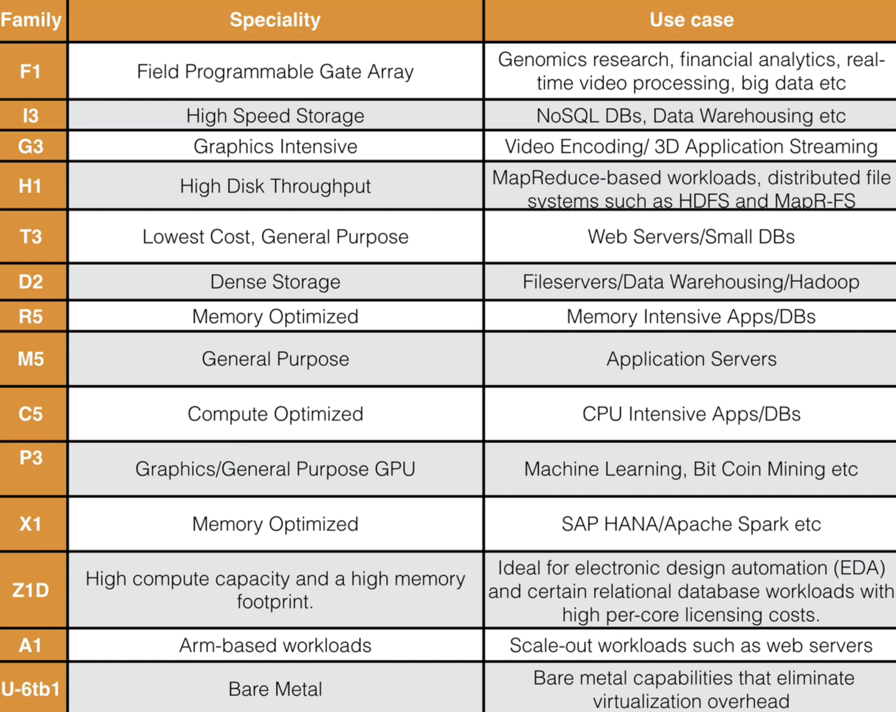
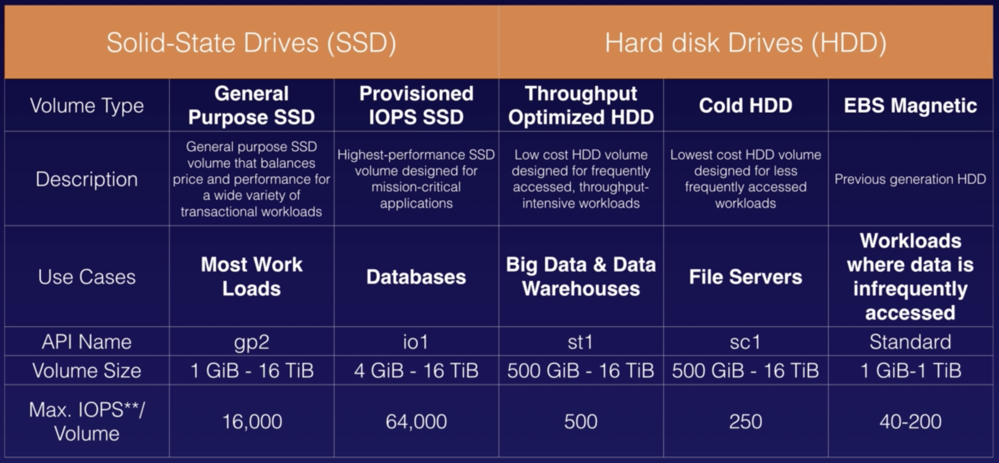
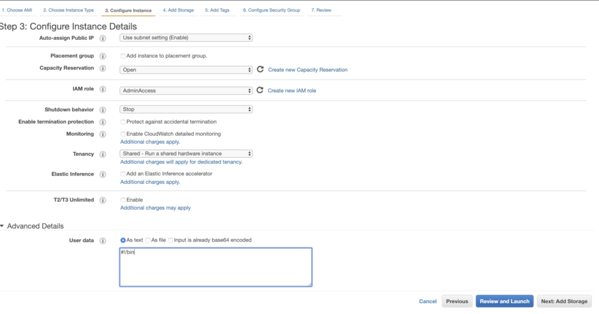

# Section 4 : EC2

 ## 23. EC2 101

### Pricing models.

**1. On Demand** : Allows you to pay a fixed rate by the hour (or by the second) with no long term commitment.

* Users that wnat the low cost and flexibility of EC2 without any up-front payment or long-term commitment.
* Applications with short term, spiky, or unpredictable workloads that can't be interrupted.

* Applications being developed or tested on EC2 for the first time.


**2. Reserved** : Provides you with a capacity reservation, and offer a significant discount on the hourly charge for an instance. Contract Terms are 1 Yr or 3Yr.

* Applications with steady state or predictable usage.
* Applications that require reserved capacity.
* Users able to make upfront payments to reduce their total computing costs even further.

*💵 Reserved Pricing Types*

1. Standard Reserved Instances

   > These offer up to 75% off on demand instances. The more you pay up front and the longer the contract, the greater the discount.

2. Convertible Reserved Instances

   > These offer up to 54% off on demand capability to change the attributes of th RI as long as the exchange results in the creation of Reserved Instances of equal or greater value.

3. Scheduled Reserved Instances

   > These are available to launch within the time windows you reserve. This option allows you to match your capacity reservation to a predictable recurrung schedule that only requires a fraction of a day, a week, or a month.


**3. Spot** : Enalbes you to bid whatever price you want for instance capicty, providing for even greater savings if your applications have flexible start and end times.

* Applications that have flexible start and end times.
* Applications that are only feasible at very low compute prices.
* Users with urgent computing needs for large amounts of additional capacity.

> If the spot instance is terminated by Amazon EC2, you won't be charged for a partial hour of usage. However, if you terminate the instance yourself, you will be charged for any hour in which the instance ran.

Amazon EC2 스팟 인스턴스를 사용하면 AWS 클라우드에서 미사용 EC2 용량을 활용할 수 있습니다. 스팟 인스턴스는 온디맨드 요금과 비교하여 최대 90% 할인된 금액으로 제공됩니다. 빅 데이터, 컨테이너식 워크로드, CI/CD, 웹 서버, 고성능 컴퓨팅(HPC), 기타 테스트 및 개발 워크로드 등 다양한 상태 비저장, 내결함성 또는 유연한 애플리케이션에 스팟 인스턴스를 사용할 수 있습니다. 스팟 인스턴스는 Auto Scaling, EMR, ECS, CloudFormation, Data Pipeline 및 AWS Batch와 같은 AWS 서비스와 긴밀하게 통합되므로, 스팟 인스턴스에서 실행되는 애플리케이션을 시작하고 유지 관리하는 방법을 선택할 수 있습니다.

그뿐만 아니라 스팟 인스턴스를 온디맨드 및 RI와 손쉽게 결합하여 성능과 함께 워크로드 비용을 더욱 최적화할 수 있습니다. AWS의 운영 규모 덕분에 스팟 인스턴스는 대규모 워크로드를 실행할 수 있는 규모와 비용 절감을 제공할 수 있습니다. 또한, EC2에서 2분 알림을 통해 용량을 되돌리는 경우 스팟 인스턴스를 하이버네이트, 중단 또는 종료할 수 있는 옵션이 제공됩니다. 최대 90%의 할인된 금액으로 이렇게 방대한 규모로 미사용 컴퓨팅 용량에 손쉽게 액세스할 수 있는 것은 AWS가 유일합니다.  


**4. Dedicated Hosts** : Physical EC2 server dedicated for your use. Dedicated Hosts can help you reduce costs by allowing you to use your existing server-bound software licences.

* Useful for regulartory requirements that may not support multi-tenant virtualization.
* Great for licensing which does not support multi-tenancy or cloud deployments.
* Can be purchased On-Demand (hourly.)
* Can be purchased as a Reservation for up to 70% off the On-Demand price.




 

## 24 ~25 EC2 Hands on

### Exam tips

* Termination Protection is turned off by default, you must turn it on.
* On an EBS-backed instance, the dafult action is for the root EBS volume to be deleted when the instance is terminated.
* EBS Root Volumes of your default AMI's can be encrypted. You can also use a third party tool (such as bit locker etc) to encrypt the root volume, or this can be done when creating AMI's (lab to follow) in the AWS console or using the API.
* Additional volumes can be encrypted.


## 26. Security Group Basic

### Exam tips

* All inbound traffic is blocked by default.
* All outbound traffic is allowed.
* Changes to security group take effect immediately.
* You can have any number of EC2 instances within a security group.
* You can have multiple security groups attached to EC2 instances.
* Security groups are stateful.
* If you create an inbound rule allowing traffic in, that traffic is automatically allowed back out again.
* You cannot block specific IP addresses using security groups, instead use Network Access Control List.
* You can speicify allow rules, but not deny rules.


## 27. EBS 101

Amazon Elastic Block Store provides presistent block storage volumes for use with Amazon EC2 instances in the AWS Cloud. Each Amazon EBS volume is automatically replicated within its Availability Zone to protect you from component failure, offering high availability and durability.

#### 5 Different Types of EBS Storage;

* General Purpose (SSD)

* Provisioned IOPS (SSD)

  > really-really fast.

* Throughput optimised Hard Disk Drive

* Cold Hard Disk Drive

* Magnetic



> *IOPS : Input Output Operation Per Second.*


## 28. Volumes & Snapshots

##### 참고

https://www.unixarena.com/2017/12/para-virtualization-full-virtualization-hardware-assisted-virtualization.html/

### Exam tips

* Volumes exist on EBS. (Think of EBS as a virtual hard disk)
* Snapshots exist on S3. Think of snapshots as a photograph of the disk.
* Snapshots are point in time copies of Volumes.
* **Snapshots are incremental** ; this means that only the blocks that have changed since your last snapshot are moved to S3.
* If this is your first snapshot, it may take some time to create.
* To create a snapshot for Amazon EBS volumes that serve as root devices, you should stop the instance before taking the snapshot.
* However you can take a snap while the instance is running.
* You can create AMI's from both Volumes and Snapshots.
* You can change EBS volume sizes on the fly, including changing the size and storage type.
* **To move an EC2 volume from one AZ to another, take a snapshot of it, create an AMI from the snapshot and then use the AMI to launch the EC2 instance in a new AZ.**

* **To move an EC2 voluem from one region to another, take a snapshot of it, create an AMI from the snapshot and then copy the AMI from one region to the other. Then use the copied AMI to launch the new EC2 instance in the new region.**


## 29. AMI Types (EBS vs Instance Store)

### You can select your AMI based on:

* Reigion (see Regions and Availability Zones)

* OS

* Architecture (32bit or 64bit)

* Launch Permissions

* Storage for the Root Device (Root Device Volume)

  * Instance Store (Ephemeral storage)

    > Ephimeral : 임시

  * EBS Backed Volumes


All AMIs are categorized as either backed by Amazon EBS or backed by instance store.

#### For EBS Volumes

The root device for an instance launched from the AMI is an Amazon EBS volume created from an Amazon EBS snapshot.

#### For Instance Store Volumes

The root device for an instance launchrd from the AMI is an instance store volume created from a template stored in Amazon S3.


### Exam tips

* Instance Store Volumes are somtimes called ephemeral storage.
* Instance store volumes cannot be stopped. If the underlying host fails, you will lose your data.
* EBS backed instances can be stopped. You will not lose the data on this instance if it is stopped.
* You can reboot both, you will not lose your data.
* By default, both ROOT volumes will be deleted on termination. However, with EBS volumes, you can tell AWS to keep the root device volume.


## 30. Encrypt Root Device Volumes & snapshots.

 ### Exam tips

* Snapshots of encrypted volumes are encrypted automatically.
* Volumes restored from encrypted snapshots are encrypted automatically.
* You can share snapshots, but only if ther are unencrypted.
* These snapshots can be shared with other AWS account or made public.
* You can now encrypt root device volumes upon creation of the EC2 instance.
  * Create a snapshot of the unencrypted root device volume.
  * Create a copy of the snapshot and select the encrypt option.
  * Create an AMI from the encrypted snapshot.
  * Use that AMI to launch new encrypted instances.


## 32. Cloudwatch 101

Amazon CloudWatch is a monitoring service to monitor your AWS resources, as well as the applications that you run on AWS.

### CloudWatch can monitor things like...

* Compute
  * EC2 Instances 
  * Autoscaling Groups
  * Elastic Load Balancers
  * Route53 Health Checks
* Storage & Content Delivery
  * EBS Volumes
  * Storage Gateways
  * CloudFront


### Host Level Metrics Consist of:

* CPU
* Network
* DIsk
* Status Check


### AWS CloudTrail

AWS CloudTrail increases visibility into your user and resource activity by recording AWS Management Console actions and API calls. You can identify which users and accounts called AWS, the source IP address from which the calls were made, and when the calls occurred.

> CCTV.... 👀


* CloudWatch monitors performance.

* CloudTrail monitors API calls in the AWS platform.

  > CloudWatch is all about performance. CloudTrail is all about auditing.

* CloudWatch with EC2 will monitor events every 5 minutes by default.

* You can have 1 minute intervals b turning on detailed monitoring.

* You can create CloudWatch alarms which trigger notifications.


## 33. CloudWatch Lab

### CloudWatch ExamTips

* Standard Monitoring = 5 Minutes
* Detailed Monitoring = 1 Minute

#### What Can I do with CloudWatch?

* Dashboards : Creates awesome dashboards to see what is happening with your AWS environment.
* Alarms : Allows you to set Alarms that notify you when particular thresholds are hit.
* Events : CloudWatch Events helps you to response to state changes in your AWS resources.

* Logs : CloudWatch Logs helps you to aggregate, monitor, and store logs.


## 34. AWS CLI

### ExamTips

* You can interact with AWS from anywhere in the world just by using the CLI.
* You will need to set up access in IAM.
* Commands themselves are not in the exam, but some basic commands will be useful to know for real life.


## 35. Using IAM Roles With EC2

* Roles are more secure than storing your access key and secret access key on individual EC2 instancds.
* Roles are easier to manage.
* Roles can be assigned to an EC2 instance after it is created using both the console & command line.
* Roles are universal - You can use them in any region.


## 36. Using Boot strap Scripts

> Automating AWS!



> 여기에 스크립트를 친다.

```bash
#!/bin/bash
yum update -y
yum install httpd -y
service httpd start
checkconfig http on
cd /var/www/html
echo "<html><h1>Hello world.</h1></html>" > index.html
aws s3 mb s3://cloudguru123123
aws s3 cp index.html  s3://cloudguru123123
```


## 37. EC2 Instance Metadata

```bash
[root@ip-172-31-22-213 ec2-user]# curl http://169.254.169.254/latest/user-data
#!/bin/bash
yum update -y
yum install httpd -y
service httpd start
checkconfig http on
cd /var/www/html
echo "<html><h1>Hello world.</h1></html>" > index.html
aws s3 mb s3://cloudguru123123
aws s3 cp index.html  s3://cloudguru123123
```

```bash
[root@ip-172-31-22-213 ec2-user]# curl http://169.254.169.254/latest/user-data > bootstrap.txt
[root@ip-172-31-22-213 ec2-user]# aws s3 mb s3://cloudguru123123
[root@ip-172-31-22-213 ec2-user]# aws s3 cp index.html s3://cloudguru123123
```

```
[root@ip-172-31-22-213 ec2-user]# curl http://169.254.169.254/latest/meta-data/
```

```
[root@ip-172-31-22-213 ec2-user]# curl http://169.254.169.254/latest/meta-data/local-ipv4
[root@ip-172-31-22-213 ec2-user]# curl http://169.254.169.254/latest/meta-data/public-ipv4 
```

### Exam Tips

* Used to get information about an instance (such as public ip)

  ` curl http://169.254.169.254/latest/meta-data/` or ` curl http://169.254.169.254/latest/user-data/`

  

## 38. Elastic File System (EFS)

https://help.acloud.guru/hc/en-us/articles/115002011194

Amazon EFS is a file storage service for Amazon EC2 instances. Amazon EFS is easy to use and provides a simple interface that allows you to create and configure file systems quickly and easily. With Amazon EFS, storage capacity is elastic, growing and shrinking automatically as you add and remove files, so your applications have the storage they need, when they need it.

#### Bootstrap code

````
#!/bin/bash
yum update -y
yum install httpd -y
service httpd start
checkconfig http on
yum install -y amazon-efs-utils
````

##### 참고 : NFS

> https://help.ubuntu.com/lts/serverguide/network-file-system.html

```
[root@ip-172-31-22-213 ec2-user]# cd /var/www
[root@ip-172-31-22-213 ec2-user]# mount -t efs -o tls fs-9816b269:/ /var/www/html
```

### Exam Tips

* Support the NFSv4 (Network FIle System Version4) protocol

  > port # : 2049

* You only pay for the storage you use (no pre-provisioning required.)

* Can scale up to the petabytes.

* Can suppoer thousands of concurrent NFS connections.

* Data is stored across multiple AZ's within a region.

* Read After Write Consistency


## 39. EC2 Placement Group

### Three Types of Placement Groups;

* Clustered Placement Group

  A grouping of instances within a single AZ. Placement groups are recommended for applications that need low network latency, high network throughput or both.

  Only certain instances can be launched in to a Clustered Placement Group.

* Spread Placement Group

  A group of instances that are each placed on distinct underlying hardware. 

  Spread placement groups are recommended for applications that have a small number of critical instances that should be kept seperate from each other.

  **THINK INDIVIDUAL INSTANCES**

  > seperate racks with seperate network inputs as well as a seperate power requirements. one ec2 instance is completely isolated from individual ec2 instance.

  protect from hardware failure but it's individual instances put on individual racks inside either same az or different az depending how you firgure it.

* Partitioned

  When using partition placement groups, EC2 divides each group into logical segments called partitions.

  EC2 ensures that each partition within a placement group has its own set of racks. Each racks has its own network and power source. No two partitions within a placement group share the same racks, allowing you to isolate the impact of hardware failure witihin your application.

  **THINK MULTIPLE INSTANCES**


### Exam tips

* Clustered Placement Group
  * Low network latency / high network throughput
* Spread Placement Group
  * Individual critical EC2 instances.
* Partitioned
  * Multiple EC2 instances HDFS, HBase and Cassandra.


* A clustered placement group can't span multiple AZ.
  * A spread placement and partioned group can.
* The name you specify for a placement group must be unique within your AWS account.
* Only certain types of instances can be launched in a placement group. (Compute Optimized, GPU, Memory Optimized, Storage Optimized)
* AWS recommend homogenous instances within clustered placement groups.
* You can't merge placement groups.
* You can't move an existing instances into a placement group. You can create an AMI from your existing instances, and then launch a new instance from the AMI into a placement group.

